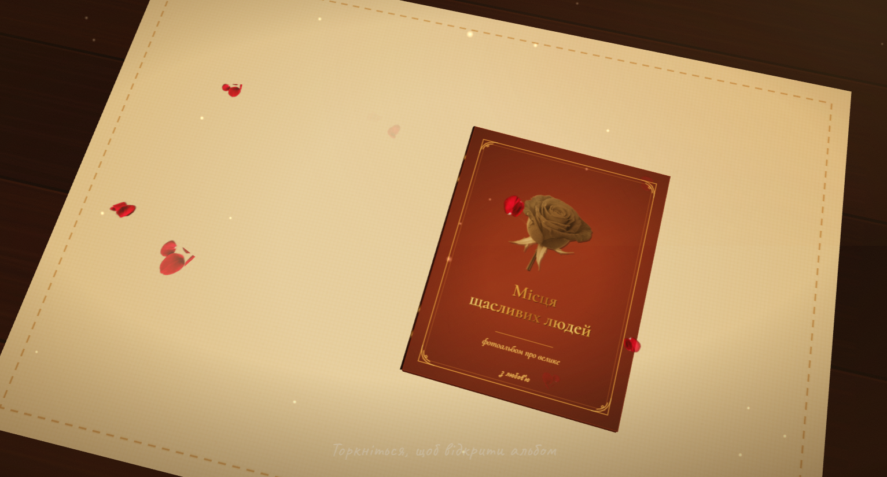

# Happy People's Places

> An interactive 3D photo album built on Three.js. The cover opens, pages turn with a realistic paper-bend effect, petals fall, music plays, and voice messages can be scrubbed with a finger. Everything runs in the browser — no backend, no build step.

<p align="center">
  
</p>

---

## Table of Contents

- [What This Is](#what-this-is)
- [Features](#features)
- [Technologies](#technologies)
- [Project Structure](#project-structure)
- [Quick Start](#quick-start)
- [Configuring the Album](#configuring-the-album)
  - [Media Folder Structure](#media-folder-structure)
  - [Adding Photos and Videos](#adding-photos-and-videos)
  - [Adding Decorations](#adding-decorations)
  - [Adding Music and Voice](#adding-music-and-voice)
  - [Tuning the Scene](#tuning-the-scene)
- [Page Type Reference](#page-type-reference)
  - [title — title page](#title--title-page)
  - [photo — photo page](#photo--photo-page)
  - [stack — photo stack](#stack--photo-stack)
  - [letter — letter](#letter--letter)
  - [popup — 3D pop-ups](#popup--3d-pop-ups)
  - [closing — closing page](#closing--closing-page)
- [Decoration Reference](#decoration-reference)
- [Photo Frame Reference](#photo-frame-reference)
- [Layout Reference](#layout-reference)
- [Controls](#controls)
- [Deployment](#deployment)
- [Browser Support](#browser-support)
- [Troubleshooting](#troubleshooting)
- [License](#license)

---

## What This Is

A self-contained template for a gift photo album. You open the page — a closed book in a leather binding lies on a table. You touch it — the cover opens, the camera flies in, and the journey through pages begins.

Each page can contain:

- one large photo, two, three, or a grid of four;
- a "live" stack of photos that drop one onto another as you turn pages;
- a handwritten letter with ruled lines like in a notebook;
- 3D pop-ups that "grow" out of the page when it opens;
- decorations: washi tape, flowers, stamps, hearts, sparkles;
- a voice message with a player and a waveform you can scrub;
- a video that plays right on the page.

All of this — one HTML file plus a folder of modules. **No build step, no Node.js, no npm.** A local web server is enough.

---

## Features

| | |
|---|---|
| **Animated cover** | The spine dissolves on open, the cover turns smoothly |
| **Realistic page turning** | A vertex shader bends the sheet along an arc, the edge curls |
| **Corner dragging** | You can pull the page with your finger/mouse like a real one |
| **Photos, videos, decor** | Polaroids, frames, corner mounts, stamps |
| **Photo stacks** | Photos drop one by one on every forward turn |
| **Living decor** | Petals fall, dust glows |
| **Voice messages** | Play/pause + scrubbing along the waveform |
| **Background music** | Auto-ducks when a voice message plays |
| **3D pop-ups** | Separate meshes that unfold with the page |
| **Responsive** | Portrait/landscape, safe-area, touch |
| **Reduced-motion** | Respects `prefers-reduced-motion` |
| **Asset warnings** | If something is missing, it shows what exactly |

---

## Technologies

| | |
|---|---|
| [Three.js 0.160](https://threejs.org/) | WebGL rendering, shaders, GLTF, OrbitControls |
| Native ES modules + importmap | No bundler, no build step |
| Canvas 2D | All page "printing" (backgrounds, frames, text, decor) |
| WebAudio API | Procedural sound effects (rustle, click, thud) |
| HTMLAudio | Background music + voice messages |
| Google Fonts | Cormorant (headings), Caveat (handwriting) |

> **No build step whatsoever.** `index.html` loads `src/main.js`, which pulls in the rest via `import`. Just like 2015, but with an importmap.

---

## Project Structure

```
happy-places/
├── index.html                    ← HTML shell + importmap + UI markup
├── music.mp3                     ← background music
├── imgs/
│   ├── dummy.jpg                 ← sample photo (replace with yours)
│   └── decor/
├── audio/                        ← voice messages
│   └── greeting.mp3
├── models/                       ← GLB models (optional)
├── styles/
│   └── main.css                  ← all UI styles
└── src/
    ├── main.js                   ← entry point, orchestrates init()
    │
    ├── config/                   ← WHAT YOU EDIT
    │   ├── paths.js              ← media paths
    │   ├── assets.js             ← PHOTO_FILES, DECOR_FILES
    │   ├── theme.js              ← colors, photo scale
    │   ├── scene.js              ← camera, lighting, table, particles
    │   └── album.js              ← THE ALBUM: PAGES, covers
    │
    ├── core/                     ← state, progress, audio, tweens
    │   ├── store.js              ← global state
    │   ├── progress.js           ← loading progress
    │   ├── warnings.js           ← missing-asset overlay
    │   ├── tween.js              ← animations
    │   └── audio.js              ← WebAudio, music, voice player
    │
    ├── loaders/                  ← media loading
    │   ├── media.js              ← photos, decor, voice
    │   ├── models.js             ← GLB models
    │   └── progress-count.js     ← task counting
    │
    ├── paint/                    ← all 2D graphics
    │   ├── utils.js              ← canvas helpers
    │   ├── backgrounds.js        ← paper, leather, wood, linen
    │   ├── frames.js             ← cover frames
    │   ├── text.js               ← text rendering
    │   ├── photos.js             ← polaroids, corner mounts
    │   ├── decor-primitives.js   ← tape, hearts, stamps
    │   ├── decor-items.js        ← decor dispatcher
    │   ├── voices.js             ← voice widget
    │   └── pages.js              ← page composition
    │
    ├── scene/                    ← 3D scene
    │   ├── layout.js             ← page and book dimensions
    │   ├── utils.js              ← THREE helpers
    │   ├── shaders.js            ← GLSL
    │   ├── setup.js              ← renderer, camera, lights, table
    │   ├── album.js              ← 3D geometry of the book
    │   ├── sheets.js             ← shader-driven sheets
    │   ├── positions.js          ← sheet heights
    │   ├── popups.js             ← 3D pop-ups
    │   ├── models.js             ← models on the table
    │   ├── particles.js          ← petals, dust
    │   └── proxies.js            ← raycast planes
    │
    ├── interaction/              ← input
    │   ├── open-close.js         ← open/close
    │   ├── flip.js               ← page turning
    │   ├── stack.js              ← photo dropping
    │   ├── pointer.js            ← mouse/touch
    │   └── ui.js                 ← buttons, keyboard
    │
    └── render/
        ├── video.js              ← RVFC, video sync
        └── loop.js               ← requestAnimationFrame loop
```

**Key rule:** to build a new album, you only need to edit **files inside `src/config/`** and drop your media into `imgs/`, `audio/`, `models/`. The code in `paint/`, `scene/`, `interaction/` is the "engine" — you never touch it.

---

## Quick Start

### 1. Clone / copy the project

```bash
git clone https://github.com/USER/happy-places.git
cd happy-places
```

Or just unzip into any folder.

### 2. Start a local server

ES modules **do not work over `file://`**. You need any local server.

**Python (available everywhere):**
```bash
python3 -m http.server 8000
```

**Node.js:**
```bash
npx serve .
# or
npx http-server -p 8000
```

**PHP:**
```bash
php -S localhost:8000
```

**VS Code:** install the [Live Server](https://marketplace.visualstudio.com/items?itemName=ritwickdey.LiveServer) extension → right-click `index.html` → **Open with Live Server**.

### 3. Open in the browser

```
http://localhost:8000/
```

You'll see a loader with a rose, then the cover. Touch it — the album opens.

---

## Configuring the Album

### Media Folder Structure

The project looks for files at fixed paths. If your structure differs — edit `src/config/paths.js`.

| Folder | Purpose | Formats |
|---|---|---|
| `imgs/` | Photos, videos for pages | `jpg`, `jpeg`, `png`, `webp`, `mp4`, `webm`, `mov` |
| `imgs/decor/` | Decorations (flowers, petals, twigs) | `png` (with transparency!), `webp`, `jpg` |
| `audio/` | Voice messages | `mp3`, `m4a`, `ogg`, `wav`, `aac`, `opus` |
| `models/` | GLB models for 3D pop-ups | `glb` |
| `music.mp3` | Background music (single file) | `mp3` |

> **Tip.** Use **PNG with transparency** for decorations — otherwise you'll get a white box around the flower. For photos — `webp` or `jpg` (smaller, load faster).

### Adding Photos and Videos

**Step 1.** Drop your files into `imgs/`. For example:

```
imgs/
├── morning.jpg
├── sea-2024.mp4
└── sunset.webp
```

**Step 2.** Register them in `src/config/assets.js`:

```js
export const PHOTO_FILES = {
  morning:  'morning',      // key → file name without extension
  sea:      'sea-2024',
  sunset:   'sunset'
};
```

The key (left side) is how you reference the file in `PAGES`. The value (right side) is the file name without extension. The program picks the extension automatically from `PHOTOS_IMAGE_EXTS` / `PHOTOS_VIDEO_EXTS`.

**Step 3.** Use it in `PAGES` (see below).

**Step 4 (optional).** If you want a video to play right on the page — add `video: true`:

```js
{ type: 'photo', photos: [
  { img: 'sea', video: true, caption: 'Our sea' }
]}
```

Without this tag, the program looks for an image first, and only then for a video.

**As an alternative to files** — you can inline Base64 directly in `assets.js`:

```js
export const ASSETS = {
  photos: {
    morning: 'data:image/jpeg;base64,/9j/4AAQSkZJRg...'
  }
};
```

Useful if you don't want to ship a separate file (e.g., for a single cover).

### Adding Decorations

**Step 1.** Drop a PNG into `imgs/decor/`. The file name without extension becomes the key:

```
imgs/decor/rose.png       → key: "rose"
imgs/decor/peony.png      → key: "peony"
```

**Step 2.** Register it in `src/config/assets.js` with a "default size":

```js
export const DECOR_FILES = {
  rose:    { file: 'rose',    size: 170 },
  peony:   { file: 'peony',   size: 170 },
  daisy:   { file: 'daisy',   size: 190 },  // ← your new one
  ribbon:  { file: 'ribbon',  size: 240 }
};
```

`size` is the width in pixels of the 1024×1312 canvas that the decoration will use **by default** if `size` isn't specified in `PAGES`.

**Step 3.** Use it in `PAGES`:

```js
{ type: 'ditem', key: 'daisy', at: { x: 0.15, y: 0.80 }, size: 220, rot: -18 }
```

### Adding Music and Voice

**Background music.** Drop `music.mp3` into the **project root** (next to `index.html`). That's it.

**Voice messages.** Drop the file into `audio/` and add a decor item of type `voice`:

```js
deco: [
  { type: 'voice',
    file: 'greeting',              // → audio/greeting.mp3
    at: { x: 0.5, y: 0.87 },
    size: 300,
    rot: -2,
    label: 'tap — I said this out loud' }
]
```

Voice files **don't need registration** in `assets.js` — they're found by name.

### Tuning the Scene

`src/config/scene.js` controls the environment. Key parameters:

**Lights.** Each source can be turned off (`intensity: 0`), moved (`pos`), recolored:

```js
lights: {
  hemi: { sky: '#ffe2b8', ground: '#1c0f06', intensity: 0.85 },
  sun:  { color: '#ffd9a6', intensity: 2.6, pos: [2.3, 4.3, 2.7] },
  glow: { color: '#ffca8a', intensity: 0.5, pos: [0, 2.3, 0.7],
          distance: 6.5, decay: 1.6 }
}
```

> To enable **shadows** — set `sun.castShadow: true`. Shadows are resource-heavy (especially on mobile).

**Camera.** Two positions: `home` — closed book, `reading` — open:

```js
camera: {
  home:    [2.3, 1.55, 3.45],   // start
  reading: [0.15, 2.35, 2.22],  // while reading
  // ...and "targets" the camera looks at (separate for portrait orientation)
  homeTarget:            [0, 0.34],
  homeTargetPortrait:    [0, 0.20],
  readingTarget:         [0, 0.11],
  readingTargetPortrait: [0, 0.18]
}
```

**Table.** Type, color, size:

```js
table: { type: 'wood', color: '#2a1508', repeat: 3.2, size: 9 }
```

Available types: `wood` (wood), `linen` (linen), `plain` (solid).

**Cloth under the book.** Can be disabled (`enabled: false`) or changed to a linen tablecloth:

```js
cloth: { enabled: true, type: 'linen', color: '#e7d5b4',
         size: [3.9, 2.72], y: 0.004 }
```

**Petals.** Falling flowers:

```js
particles: [
  {
    type: 'fall',                    // 'fall', 'rise', 'drift', 'float'
    textures: ['petal_1', 'petal_2', 'petal_3', 'petal_4'],
    count: 12,                       // how many petals
    size: 0.075,                     // size in meters
    speed: [0.10, 0.20],             // fall-speed range
    opacity: 0.85,
    area: { x: [-1.3, 1.3], y: [0.02, 2.7], z: [-0.8, 1.0] }
  }
]
```

**Dust.** Glimmering specks in the air. Can be disabled (`enabled: false`) or its density changed:

```js
dust: {
  enabled: true,
  count: 90,
  size: 0.045,
  color: 0xffe0b0,
  opacity: 0.5
}
```

---

## Page Type Reference

All pages are described by the `PAGES` array in `src/config/album.js`. Pages come in **pairs** — left, right, left, right... So the count must be even.

### `title` — title page

The first page after the cover. Uses `TITLE_PAGE` defined at the top of the file.

```js
{ type: 'title' }
```

### `photo` — photo page

The most common type. Can hold 1 to 4 photos.

**One photo per page:**

```js
{
  type: 'photo',
  photos: [{
    img: 'morning',
    caption: 'A morning that starts with you',
    date: 'May 2023',
    aspect: 16/9,       // aspect ratio
    tilt: 30.2,          // tilt in degrees
    frame: 'polaroid'    // frame type
  }],
  deco: [
    'tape',
    { type: 'ditem', key: 'rose', at: { x: 0.86, y: 0.79 }, size: 200, rot: -25 }
  ],
  text: [
    { content: 'MAY', at: { x: 0.5, y: 0.06 }, anchor: 'c',
      font: '600 36px Cormorant, serif', fill: '#8a5a2b' }
  ]
}
```

**Two photos** (`duo` layout):

```js
{
  type: 'photo',
  layout: 'duo',
  photos: [
    { img: 'sea',  caption: 'Sea',  frame: 'polaroid' },
    { img: 'field', caption: 'Field', frame: 'none' }
  ]
}
```

**Three photos** (`trio`) and **four** (`grid`) — same, with `layout`.

> If `layout` is omitted, the program picks one automatically: 1 → `single`, 2 → `duo`, 3 → `trio`, 4 → `grid`.

### `stack` — photo stack

Photos lie one on top of another. Each forward turn drops the top one onto the stack. Backward turns return a photo.

```js
{
  type: 'stack',
  style: 'fall',           // 'fall', 'fan', 'sweep'
  photos: [
    { img: 'one', x: 0.50, y: 0.40, w: 0.55, rot: -6, aspect: 4/3, frame: 'polaroid' },
    { img: 'two', x: 0.55, y: 0.45, w: 0.52, rot:  5, aspect: 16/9 },
    { img: 'three', x: 0.47, y: 0.50, w: 0.53, rot: -3 },
    { img: 'four', x: 0.52, y: 0.55, w: 0.50, rot:  8, frame: 'rounded' }
  ]
}
```

| Field | Description |
|---|---|
| `x`, `y` | Position on the page, fraction (0..1) |
| `w` | Width as a fraction of page width |
| `rot` | Tilt in degrees |
| `aspect` | Aspect ratio |
| `frame` | Frame type |

Drop styles:

| Style | Description |
|---|---|
| `fall` | Falls from above with a small random offset |
| `fan` | Flies out from the page center, spins, lands |
| `sweep` | Sweeps in from the side along a shallow arc |

### `letter` — letter

Text on a page, like in a notebook — ruled lines under each row.

```js
{
  type: 'letter',
  heading: 'Dear [Name],',
  body: [
    'When I flip through these pages, I hear your laugh again...',
    'In every moment — you...'
  ],
  sign: '— yours, forever'      // optional signature
}
```

### `popup` — 3D pop-ups

A special type: elements "grow" out of the page as it opens. Each element is `kind: 'photo' | 'ditem' | 'model'`.

```js
{
  type: 'popup',
  text: [
    { content: 'OUR MOMENTS', at: { x: 0.5, y: 0.07 }, anchor: 'c',
      font: '600 56px Cormorant, serif', fill: '#8a5a2b' }
  ],
  elements: [
    { kind: 'photo', img: 'morning', at: { x: 0.26, y: 0.60 },
      w: 0.36, frame: 'polaroid', caption: 'Morning' },
    { kind: 'photo', img: 'sea',     at: { x: 0.72, y: 0.60 },
      w: 0.36, frame: 'polaroid', caption: 'Sea' },
    { kind: 'ditem', key: 'rose',    at: { x: 0.08, y: 0.95 }, size: 0.10 }
  ]
}
```

| Field | Description |
|---|---|
| `at.x`, `at.y` | Position of the "hinge" point, fraction (0..1) |
| `angle` | Opening angle in degrees (default 90) |
| `w` (for photo) | Width as a fraction of the page |
| `size` (for ditem) | Width as a fraction of the page |

### `closing` — closing page

The last page. Defaults to `CLOSING_DEFAULTS`.

```js
{ type: 'closing' }
```

Can be overridden:

```js
{ type: 'closing',
  text: [
    { content: 'thank you\nfor these moments',
      at: { x: 0.5, y: 0.676 }, anchor: 'c',
      font: 'italic 500 46px Cormorant, serif',
      fill: '#6b4a35', lineHeight: 63 }
  ]
}
```

---

## Decoration Reference

Decorations are added to any page inside the `deco` array. Each item is either a shorthand string (`'tape'`, `'corners'`) or an object with a `type` field.

### Positioning

There are two ways to place decor:

**1. Via `at`** — absolute coordinates as page fractions:

```js
{ type: 'heart', at: { x: 0.5, y: 0.86 }, size: 44 }
```

**2. Via `photo` + `anchor` + `dx`/`dy`** — anchored to a photo:

```js
{ type: 'ditem', key: 'rose', photo: 0, anchor: 'tr', dx: -10, dy: -6 }
```

`photo` is the index in the photos array (0, 1, 2...). `anchor` is the point on the photo:

```
nw  n  ne
w   c   e
sw  s  se
```

`dx`, `dy` — offset in pixels from that point.

### Common Fields

| Field | Description |
|---|---|
| `type` | Decor type |
| `at` | Absolute position `{ x, y }` (0..1) |
| `photo` | Index of the photo to anchor to |
| `anchor` | Anchor point |
| `dx`, `dy` | Offset in pixels |
| `size` | Size |
| `rot` | Rotation in degrees |
| `alpha` | Opacity (0..1) |
| `behind` | `true` — draw **under** the photo |

### Types

#### `ditem` — any image from `imgs/decor/`

```js
{ type: 'ditem', key: 'rose', at: { x: 0.5, y: 0.36 }, size: 416, rot: -25 }
```

| Field | Description |
|---|---|
| `key` | Key from `DECOR_FILES` |
| `src` | Direct file path (alternative to `key`) |
| `tintMode` | `'foil'` (gold), `'replace'`, `'multiply'` |
| `tint` | Color for `tintMode` |
| `goldShadow` | `true` — add a dark shadow under the gold |

#### `tape` — washi tape

Shorthand: `'tape'` (regular) or `'tape2'` (gold).

```js
{ type: 'tape', photo: 0, at: { x: 0.27, y: 0.14 },
  size: 120, rot: -8, variant: 'gold' }
```

Without `at` — auto-applied to the top of the photo on both sides.

#### `corners` — photo corner mounts

Shorthand: `'corners'`.

```js
{ type: 'corners', photo: 0, behind: true, inset: -2 }
```

| Field | Description |
|---|---|
| `corners` | Array `['tl','tr','bl','br']` — which corners to draw |
| `inset` | Offset outward/inward |

#### `heart` — heart

```js
{ type: 'heart', at: { x: 0.5, y: 0.86 }, size: 44, color: 'rgba(181,72,58,.85)' }
```

#### `clip` — paper clip

```js
{ type: 'clip', photo: 1, anchor: 't', dx: 0, dy: -28, rot: 6 }
```

#### `stamp` — round stamp

Shorthand: `'stamp'` or `'stamp2'`.

```js
{ type: 'stamp', at: { x: 0.86, y: 0.16 }, rot: -14,
  lines: ['happiness', '2024'], size: 104 }
```

#### `star` / `sparkle` — stars and sparkles

```js
{ type: 'star',    at: { x: 0.16, y: 0.14 }, size: 46, color: 'rgba(184,138,57,.85)' }
{ type: 'sparkle', at: { x: 0.16, y: 0.14 }, size: 34, color: 'rgba(233,200,115,.9)' }
```

#### `underline` — wavy underline

```js
{ type: 'underline', at: { x: 0.5, y: 0.78 }, size: 180, rot: -3,
  color: 'rgba(181,72,58,.75)' }
```

#### `line` — plain line

```js
{ type: 'line', at: { x: 0.5, y: 0.776 }, size: 280, width: 2,
  color: 'rgba(212,170,90,.65)' }
```

#### `text` — arbitrary text

```js
{ type: 'text', content: 'morning',
  photo: 0, anchor: 'bl', dx: 20, dy: -10,
  family: 'Caveat, cursive', size: 64, weight: 600,
  fill: 'rgba(58,36,24,.85)', rot: -6 }
```

#### `voice` — voice message

```js
{ type: 'voice', file: 'greeting', at: { x: 0.5, y: 0.87 },
  size: 300, rot: -2, label: 'tap — I said this out loud' }
```

| Field | Description |
|---|---|
| `file` | File name in `audio/` without extension |
| `label` | Caption under the player |
| `size` | Player width in canvas pixels |

---

## Photo Frame Reference

The `frame` field on a photo:

| Value | Appearance |
|---|---|
| `polaroid` | Classic polaroid with a white frame and room for a caption below |
| `polaroid-plain` | Polaroid without a caption (thinner bottom border) |
| `rounded` | Rounded corners, thin white outline |
| `border` | Thin border, no rounding |
| `none` | No frame — clean photo with a shadow |

---

## Layout Reference

| Layout | For 1 photo | For 2 | For 3 | For 4 |
|---|---|---|---|---|
| `single` | ✓ | | | |
| `duo` | | ✓ | | |
| `trio` | | | ✓ | |
| `grid` | | | | ✓ |

`single` is used by default for a single photo. For 2+ photos, layout is picked automatically. You can also set it manually via `layout`:

```js
{ type: 'photo', layout: 'duo', photos: [...] }
```

---

## Controls

### Mouse / Touch

| Action | Result |
|---|---|
| Click the closed book | Open the album |
| Click the right edge of the page | Turn forward |
| Click the left edge | Turn backward |
| Drag the right corner | Interactive page turn |
| Swipe from the right edge | Turn with inertia |
| Tap the voice player | Play / pause |
| Drag along the waveform | Scrub the voice |
| Orbit around the book (off the pages) | OrbitControls |

### Keyboard

| Key | Action |
|---|---|
| `Enter` / `Space` (on closed book) | Open |
| `→` / `PageDown` / `Space` | Forward |
| `←` / `PageUp` | Back |
| `Home` | Cascade to start |
| `End` | Cascade to end |

### Buttons

| Button | Action |
|---|---|
| 🔊 top right | Toggle sound |
| `›` right | Forward |
| `‹` left | Back |
| "View again" | Cascade to start |

---

## Deployment

Since this is a static site with no backend, any hosting will do.

### GitHub Pages

```bash
# 1. Create a repo and push the code
git remote add origin git@github.com:USER/REPO.git
git branch -M main
git push -u origin main

# 2. In repo settings: Settings → Pages → Source = "main" / "(root)"
```

A minute later it will be available at `https://USER.github.io/REPO/`.

> **Important.** If the site lives in a subpath (`/REPO/`) rather than the root, make sure all paths in `src/config/paths.js` are **relative** (no leading `/`). All project paths already are — but check anyway.

### Netlify / Vercel

Drag the project folder into the web interface — done. Or via CLI:

```bash
# Netlify
npx netlify-cli deploy --dir=.

# Vercel
npx vercel --prod
```

Leave the build command empty, set the public folder to `.` (root).

### Cloudflare Pages

Same idea: connect a Git repo, leave all defaults.

### Own server (nginx)

Just drop the project contents into `/var/www/html/`:

```nginx
server {
  listen 80;
  root /var/www/happy-places;
  index index.html;
  location / { try_files $uri $uri/ /index.html; }
}
```

---

## Browser Support

| Browser | Version |
|---|---|
| Chrome / Edge | ≥ 89 |
| Safari (macOS) | ≥ 16.4 |
| Safari (iOS) | ≥ 16.4 |
| Firefox | ≥ 108 |
| Chrome Android | ≥ 89 |

**Required APIs:**

- ES Modules + Import Maps
- WebGL 2
- WebAudio API
- Canvas 2D (with `filter` for sepia)

**If WebGL is unavailable** — a fallback message appears asking to upgrade the browser.

---

## Troubleshooting

### White screen, console says "Failed to load module script"

You opened it via `file://`. ES modules require `http://` or `https://`. Start a local server (see [Quick Start](#quick-start)).

### "doesn't provide an export named X"

In the file where `X` should be, there's no `export` before the corresponding `const`/`function`. Open the file and check.

### "Cannot access 'X' before initialization"

Circular import. Look at the full stack in the console — it will show the offending module path.

### Loader hangs forever

Open DevTools → **Network** → check which file is stuck in pending / failed.

### Photo doesn't appear

1. Check the file is in `imgs/`.
2. Check the name in `PHOTO_FILES` matches the real one (without extension).
3. Look in **Console** — there will be `[album] Media not found for key "..."`.
4. Look at **AssetWarnings** (the red overlay in the top-left) — it lists all missing assets.

### Decor doesn't appear

1. Check the file is in `imgs/decor/` and it's a **PNG with transparency**.
2. Check `DECOR_FILES` — key and file name.
3. In the console: `[album] ditem "..." file not found in imgs/decor/`.

### Music doesn't play

1. Check `music.mp3` is in the **project root** (next to `index.html`).
2. Most browsers block autoplay — a first click/tap is required. Until then the sound button is grayed out.
3. Look for the error in the console: `[music] play rejected: ...`.

### Voice doesn't play

1. Check the file is in `audio/`.
2. Check format support — `mp3` works everywhere, `m4a` almost everywhere, `opus` only in Chrome/Firefox.
3. `[album] voice "..." not found in audio/` in the console.

### Everything is black / laggy

1. Check whether hardware acceleration is enabled in the browser (`chrome://gpu`).
2. Too many petals → reduce `SCENE.particles[0].count`.
3. Too much dust → reduce `SCENE.dust.count`.
4. Shadows → disable `SCENE.lights.sun.castShadow = false`.

### Polaroid shows a white rectangle instead of a photo

The photo failed to load. See "Photo doesn't appear".

### Page won't turn

1. Check `state.mode === 'reading'` (in the console: `__dbg.state.mode`).
2. Check that `state.animating === true` or `state.drag !== null` hasn't gotten stuck.

---

## License

MIT. Do whatever you want, but **please** don't use this template to sell "made-to-order photo albums" commercially without crediting the original(although who needs it, lol).
